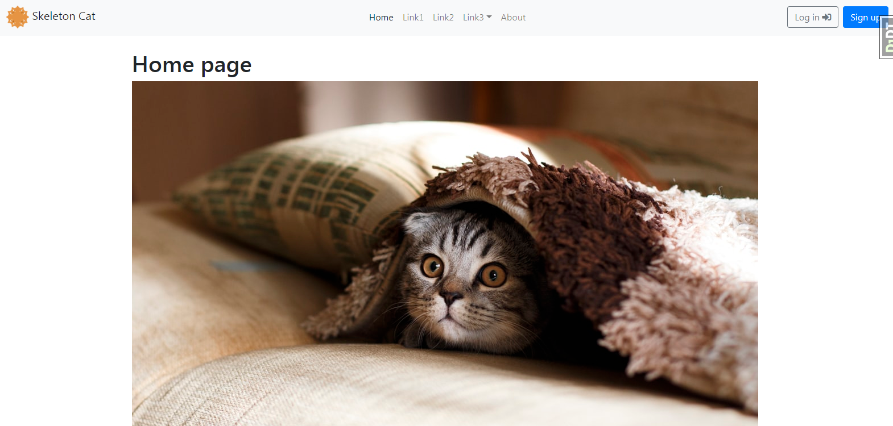
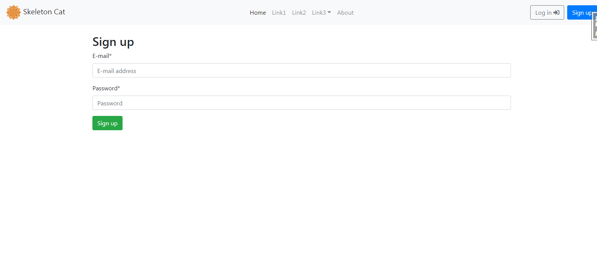
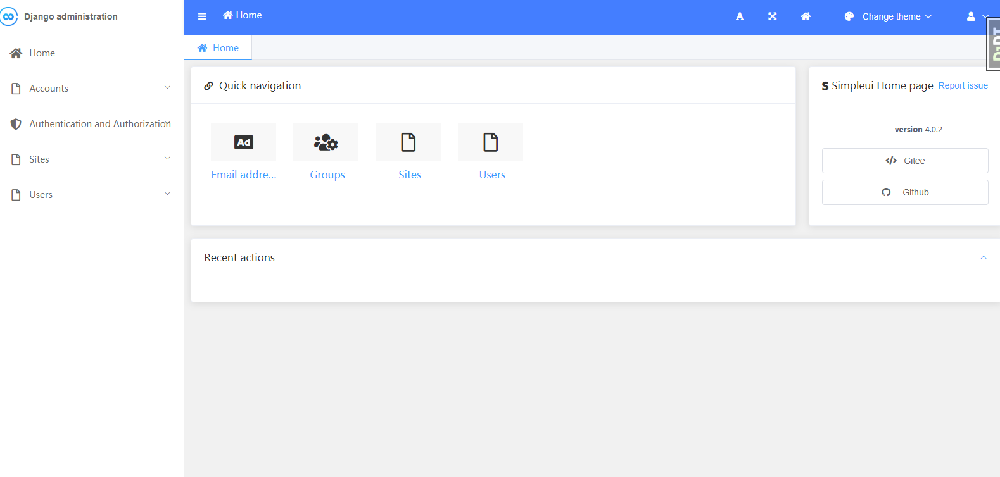

# django-skeleton-cat

   

A template for launching new Django projects quickly. 

- django-skeleton-cat : Use django Social authentication via django-allauth : https://github.com/pennersr/django-allauth
- django-skeleton-simple-cat : Use django built-in authentication system.

## Screenshots







## Features

Comes with a complete user authentication flow, custom user model, and social authentication options via Gmail, Facebook, Twitter, etc.

- For Django>=2.2 and Python>=3.7

- Styling with Bootstrap v4.5.0 : https://github.com/twbs/bootstrap

- Custom user model

- Email/password for log in/sign up instead of Django's default username/email/password pattern

- django-debug-toolbar : https://github.com/jazzband/django-debug-toolbar

- support for ~~django-suit~~  django-simpleui

- Support fontawesome 5.1: https://fontawesome.com/icons?d=gallery&q=cat&m=free

## First-time setup

setup a `virtualenv` if needed

```
mkdir env
virtualenv dj
source dj/bin/activate
```

```
cd yourproject
pip install -r requirements.txt
python manage.py makemigrations users
python manage.py migrate
```

Create a superuser:

```
python manage.py createsuperuser
test/test/test@test.com
```

Run:

```
python manage.py runserver
```

Load the site at [http://127.0.0.1:8000](http://127.0.0.1:8000).

### Authentication URL

Defualt:

```
users/ login/ [name='login']
users/ logout/ [name='logout']
users/ password_change/ [name='password_change']
users/ password_change/done/ [name='password_change_done']
users/ password_reset/ [name='password_reset']
users/ password_reset/done/ [name='password_reset_done']
users/ reset/<uidb64>/<token>/ [name='password_reset_confirm']
users/ reset/done/ [name='password_reset_complete']
```
Django-allauth:

```
accounts/ ^ ^signup/$ [name='account_signup']
accounts/ ^ ^login/$ [name='account_login']
accounts/ ^ ^logout/$ [name='account_logout']
accounts/ ^ ^password/change/$ [name='account_change_password']
accounts/ ^ ^password/set/$ [name='account_set_password']
accounts/ ^ ^inactive/$ [name='account_inactive']
accounts/ ^ ^email/$ [name='account_email']
accounts/ ^ ^confirm-email/$ [name='account_email_verification_sent']
accounts/ ^ ^confirm-email/(?P<key>[-:\w]+)/$ [name='account_confirm_email']
accounts/ ^ ^password/reset/$ [name='account_reset_password']
accounts/ ^ ^password/reset/done/$ [name='account_reset_password_done']
accounts/ ^ ^password/reset/key/(?P<uidb36>[0-9A-Za-z]+)-(?P<key>.+)/$ [name='account_reset_password_from_key']
accounts/ ^ ^password/reset/key/done/$ [name='account_reset_password_from_key_done']
```

## Next Steps

- Use [PostgreSQL locally via Docker](https://wsvincent.com/django-docker-postgresql/)
- Use [django-environ](https://github.com/joke2k/django-environ) for environment variables
- Update [EMAIL_BACKEND](https://docs.djangoproject.com/en/2.2/topics/email/#module-django.core.mail) to configure an SMTP backend
- Make the [admin more secure](https://opensource.com/article/18/1/10-tips-making-django-admin-more-secure)

## Adding Social Authentication

- [Configuring Google](https://wsvincent.com/django-allauth-tutorial-custom-user-model/#google-credentials)
- [Configuring Facebook](http://www.sarahhagstrom.com/2013/09/the-missing-django-allauth-tutorial/#Create_and_configure_a_Facebook_app)
- [Configuring Github](https://wsvincent.com/django-allauth-tutorial/)
- `django-allauth` supports [many, many other providers in the official docs](https://django-allauth.readthedocs.io/en/latest/providers.html)

### Thanks to

- icon & logo: https://www.easyicon.net/language.en/1141863-announce_cat_icon.html
- images from [unsplash](https://unsplash.com/)
- [DjangoX](https://github.com/wsvincent/djangox) BY  [wsvincent](https://wsvincent.com)